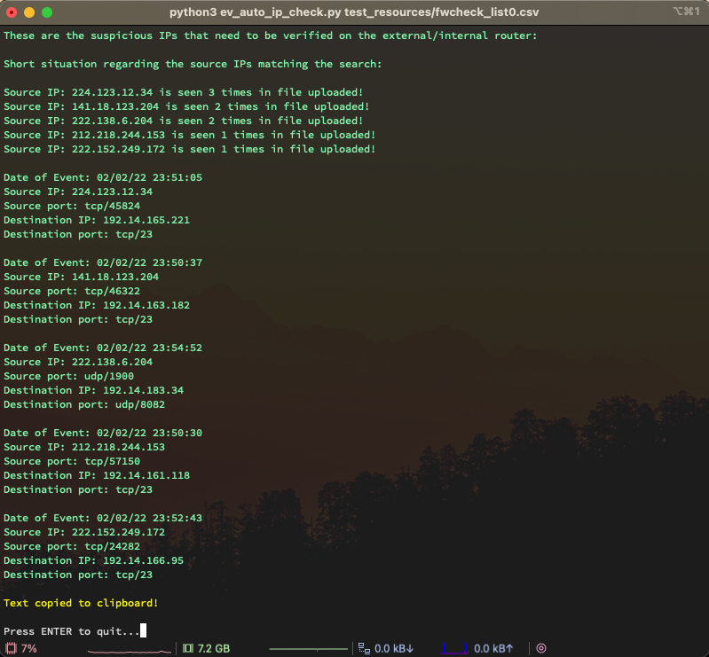

# event_viewer_auto_ip_check
A tool to quickly visualise the most active IPs blocked by a firewall in Cisco Security Manager Event Viewer.
NOTE: The input CSV must be filtered by 'Action' -> 'Deny' in Event Viewer, before being exported.

